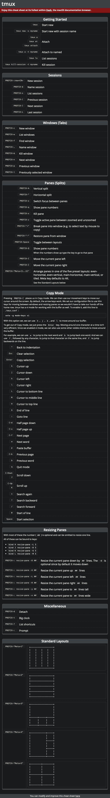

= Tmux-Demo (TechLunch - 20200227)
Boris DOLLEY <boris.dolley@rte-france.com>
v1.1, 2020-02-22 
:icons: font

:nofooter:
:toc:

//:numbered:

== THEORIE - C'est quoi Tmux ?

Tmux, tout comme Screen, est un multiplexeur de terminaux. C'est un outil permettant d'exploiter plusieurs terminaux au sein d'un seul et même affichage de terminal. Concrètement il s'agit de maintenir un terminal (une session) actif(ve) indépendamment de l'état de son affichage.

Cas d'usage typiques :

- rendre persistant un processus pérenne
- travailler en parallèle sur plusieurs "écrans" de terminal
- splitter son "écran" (indépendamment du client de Terminal (putty, terminator, etc.))

WARNING: il ne s'agit pas d'un nième utilitaire pour splitter l'écran du terminal... Le client de terminal sait le faire sans Tmux.

== PRATIQUE - Demo Time
=== Installation sur vos postes
Lancer les commandes Fedora qui vont bien pour en disposer en séance sur les laptop dév.

=== Lancer catourne.sh sans Tmux
Quitter le terminal => le processus pérenne est mort avec la session locale du terminal

=== Utilisation locale
* Par opposition : montrer la "survie" d'une session multiplexée +++<u>en local</u>+++ sur son laptop (Linux only)
* Lancer un pstree pour montrer le rattachement

[source,bash]
----

/!\ Display this doc // to terminal client

tmux

do CTRL+b c (x2) then CTRL+b p (cycle) 
do CTRL+b " then CTRL+b % then CTRL+b o (cycle)
do run cartourne.sh
do CTRL+b d then tmux ls

Go to Convention

----

=== Partageons quelques conventions de langage
- La combinaison de touche CTRL+b qui permet d'exécuter les ordres Tmux s'appelle le **prefixe** (**prefix**)
- Tmux lance des **sessions** (same in english)
- On s'**attache** ou se **détache** d'une session (**attach** / **detach**)
- En status bar on observe l'existence de **fenêtres** (**windows**)
- Si on split une fenêtre on parle de **panneaux** (**panes**)
- La barre en bas s'appelle la **barre d'état** (**status-bar**)

=== Utilisation distante
* Montrer la "survie" d'une session multiplexée +++<u>en remote (ssh)</u>+++ sur un serveur distant

WARNING: Tmux doit être installé sur ledit serveur distant

=== Tout expliquer de la CLI 
****
(ls ; new -t ; attach ; ...)
****

=== Tout expliquer des commandes PREFIXED
==== Parcourir la CheatSheet Tmux
https://kapeli.com/cheat_sheets/tmux.docset/Contents/Resources/Documents/index[One good CheatSheet]

=== Lancer plusieurs Tmux en parallèle

NOTE: Voir comment récupérer le select / auto copy / right clic to paste => perdu par Tmux

=== Commandes simultannées

CTRL+b :setw synchronize-panes on => écrira simultanément dans les panes

== Et Screen alors ?

Screen est super simple mais :
- Pas de status bar par défaut
- Pas de fonctionnalité de split screen 
- Préfixe par défaut = CTRL+a qui sert par ailleurs pour revenir en début de ligne en shell
- Pas de status-bar par défaut dans Screen => 1ère action à faire dans 

INFO: une fois qu'on maîtrise Tmux => screen c'est easy. L'inverse est moins vrai !

